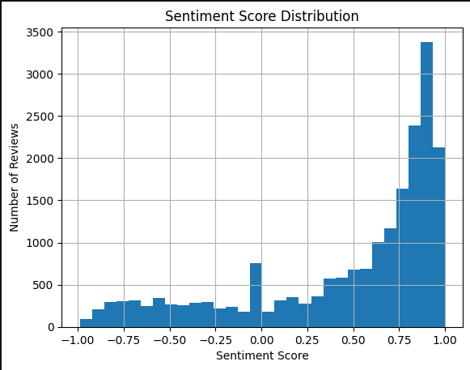
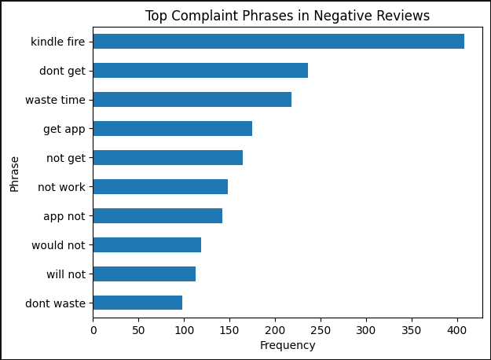

# Amazon Review Sentiment Analysis

## Project Overview
This project analyzes customer reviews from Amazon to understand sentiment patterns and common customer complaints.

## Dataset
Amazon product review dataset containing:
- review text
- sentiment label (positive / negative)

Total reviews analyzed: 20,000

## Tools Used
- SQL (PostgreSQL)
- Python
- Pandas
- VADER Sentiment Analysis
- Jupyter Notebook

## Analysis Performed
- Data cleaning
- Sentiment scoring using VADER
- Word frequency analysis
- Bigram analysis
- Review length comparison
- Positive vs negative sentiment patterns

## Key Insights
- Positive reviews had an average sentiment score of ~0.64
- Negative reviews had an average sentiment score of ~-0.08
- Common negative phrases included:
  - "not work"
  - "waste time"
  - "dont get"

These insights highlight common customer complaints that businesses could address.

## Files
amazon_analysis.ipynb → main analysis notebook  
amazon.csv → dataset

